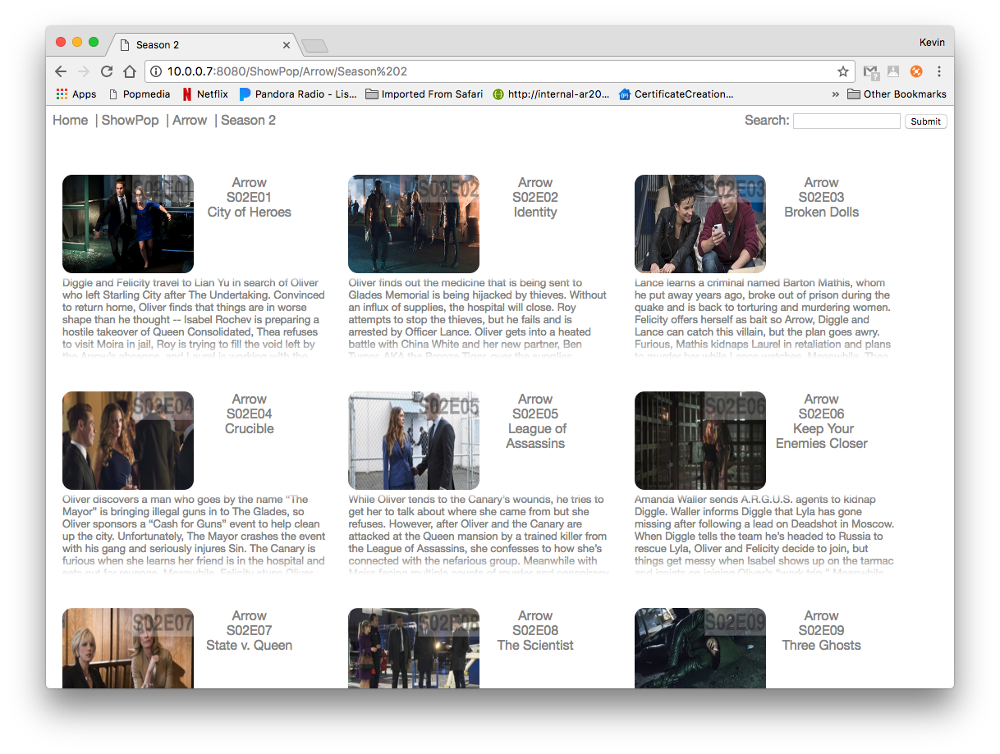

# Popmedia2

## A media server in go-lang

### To test:

```
./test.sh
```

### To run:

```
./run.sh
```

### To build:

```
./build.sh
```

### To deploy (all platforms):

```
./deploy_all.sh
```

This will create zip files under artifact for all platforms, select your platform and move the zip to the server.  Unzip the file and run the install.sh on the server.

### To install:

```
sudo ./install.sh
```

It will start up on install.

### To start:

Linux

```
sudo service popmedia-server-service start
```

Mac

```
sudo launchctl load /Library/LaunchDaemons/com.popmedic.popmedia2.plist
```

### To stop:

Linux

```
sudo service popmedia-server-service stop
```

Mac

```
sudo launchctl unload /Library/LaunchDaemons/com.popmedic.popmedia2.plist
```

### To restart:

Linux

```
sudo service popmedia-server-service restart
```

Mac

```
sudo launchctl unload /Library/LaunchDaemons/com.popmedic.popmedia2.plist && \
sudo launchctl load /Library/LaunchDaemons/com.popmedic.popmedia2.plist
```

### To configure:
Edit file `server/config.json` with the desired settings.
- Port = port to run on.
- Root = root location of site.
- Host = the name of your host.
- DirectoryImage = the path to the image to use for a directory if a custom image does not exist.
- FileImage = the path to the image to use for a file if a custom image does not exist.
- LogFile = file to log to, will log to console if none is provide (if you installed as above you will not ever see logs if you don't set this.)
- *MediaExt = currently only support MP4*

### Screen Shot of Web Portal:

